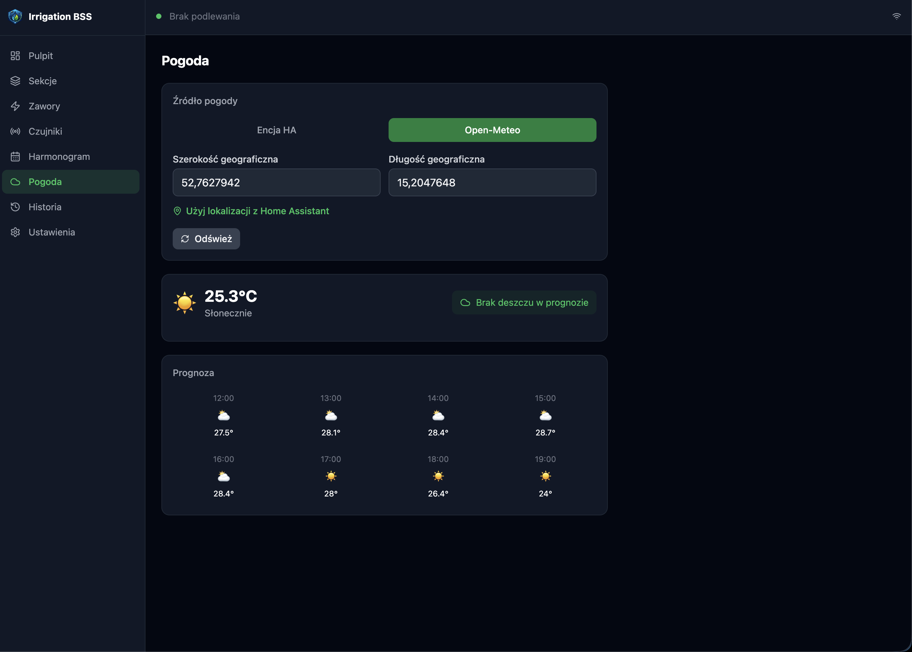
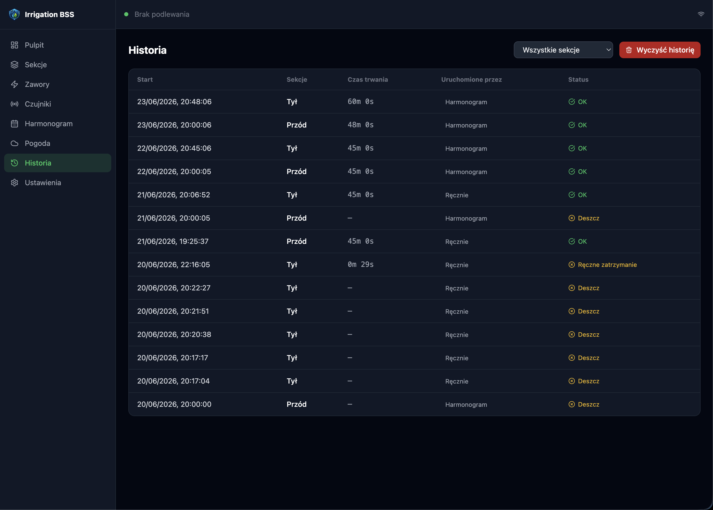

# Irrigation BSS

🇬🇧 English | [🇵🇱 Polski](README.pl.md)

Advanced irrigation management addon for Home Assistant.

## What It Is

Irrigation BSS helps you manage garden watering directly from Home Assistant.

Key capabilities:

- Watering sections with assigned valves
- Weekly scheduler with multi-zone sequential runs
- Manual quick start with custom duration
- Blocking sensors (rain, soil moisture, frost, flow meter)
- Per-schedule sensor skip flags (skip if rain / soil wet / frost)
- Weather integration
- Live dashboard with active watering and remaining time

## Installation (Stable)

1. In Home Assistant, go to **Settings → Applications → Add-on Store**.
2. Open the three-dot menu and select **Custom repositories**.
3. Add this repository: `https://github.com/BSS-Baumgart/bss_ha_irrigation`
4. Install the **Irrigation BSS** addon.
5. In **Configuration**, set `language` and `log_level`.
6. Start the addon.

## Installation (Develop Channel)

To test upcoming changes before stable releases, add the develop branch repository:

`https://github.com/BSS-Baumgart/bss_ha_irrigation#develop`

Use this on a separate test Home Assistant instance.

## First Setup

1. **Valves**: add HA entities (switch / input_boolean).
2. **Sections**: create sections and assign valves.
3. **Sensors** (optional): rain, soil moisture, frost, flow meter.
4. **Schedule**: configure weekdays, start times, durations, and optional additional sections.
5. **Dashboard**: monitor status and run manual quick actions.

## Entities Published To Home Assistant

| Entity | Type | Description |
|------|------|------|
| binary_sensor.irrigation_bss_watering | binary_sensor | Any section is currently watering |
| sensor.irrigation_bss_active_zone | sensor | Name of the active section |
| sensor.irrigation_bss_remaining_sec | sensor | Remaining watering time in seconds |
| sensor.irrigation_bss_next_watering | sensor | Next scheduled watering run |
| binary_sensor.irrigation_bss_rain_blocked | binary_sensor | Watering blocked by rain |
| binary_sensor.irrigation_bss_frost_blocked | binary_sensor | Watering blocked by frost protection |
| binary_sensor.irrigation_bss_zone_{id} | binary_sensor | Per-section watering state |

## Release Flow

- Create feature branches from develop.
- Merge features into develop for testing.
- Open PR develop -> master only for releases.
- Create tags and GitHub Releases from master.

## UI Preview

## License

MIT
