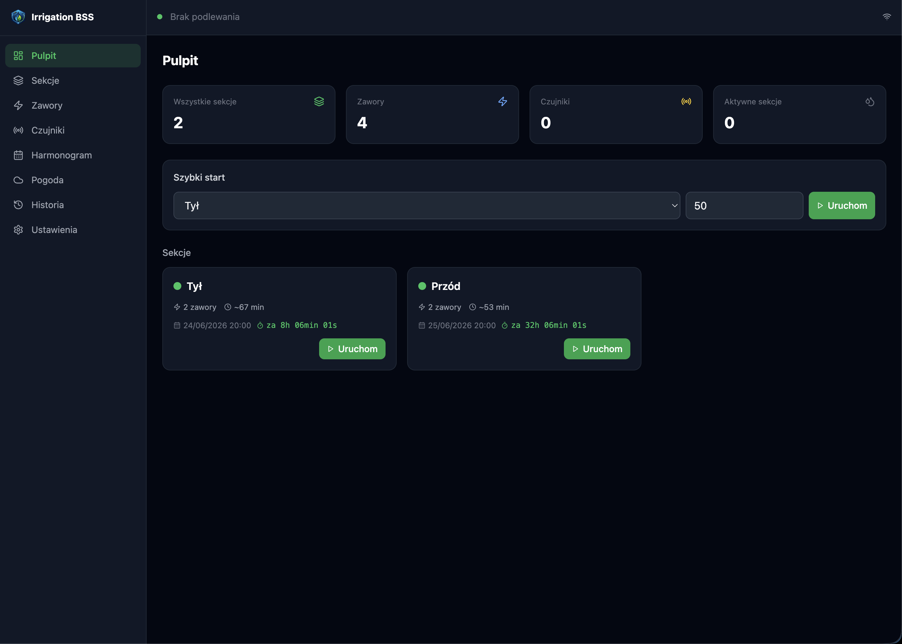
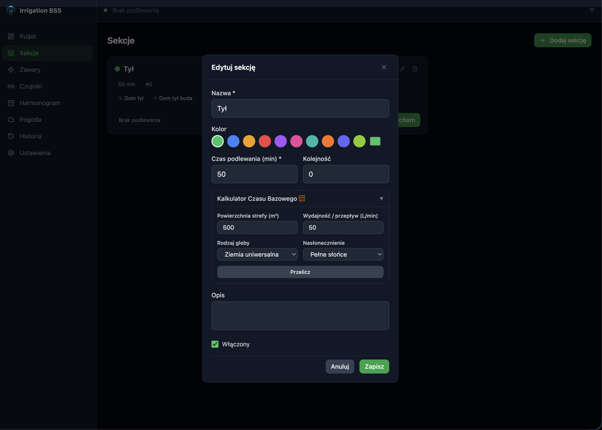
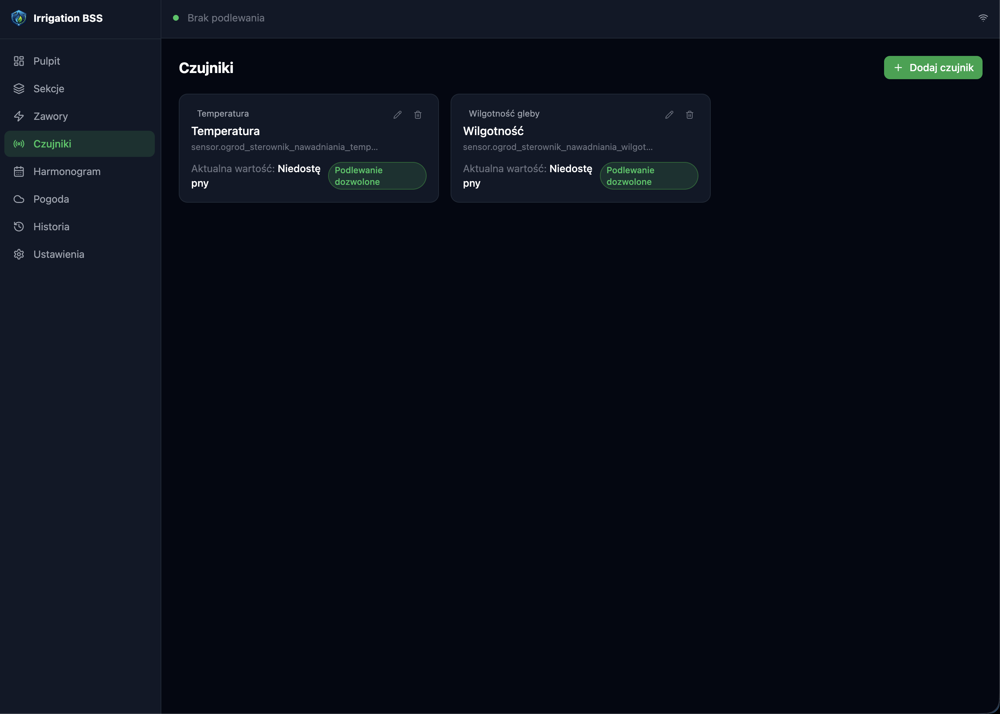
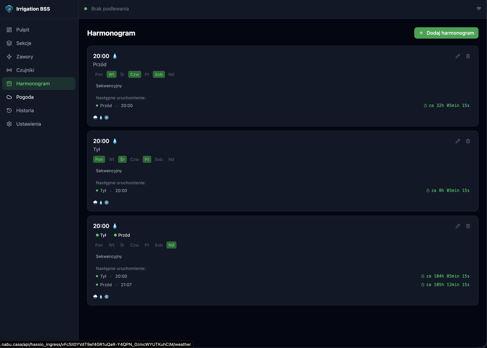

# Irrigation BSS

[🇬🇧 English](README.md) | 🇵🇱 Polski

Zaawansowany dodatek do zarządzania nawadnianiem dla Home Assistant.

## Czym jest

Irrigation BSS pozwala zarządzać podlewaniem ogrodu bezpośrednio z Home Assistant.

Główne funkcje:

- Sekcje nawadniania z przypisanymi zaworami
- Tygodniowy harmonogram z sekwencyjnym uruchamianiem wielu sekcji
- Ręczny szybki start z własnym czasem trwania
- Czujniki blokujące (deszcz, wilgotność gleby, mróz, przepływomierz)
- Per-harmonogram flagi pomijania (pomiń jeśli deszcz / mokra gleba / mróz)
- Integracja z pogodą
- Dashboard na żywo z aktywnym podlewaniem i pozostałym czasem

## Instalacja (stabilna)

1. W Home Assistant przejdź do **Ustawienia → Aplikacje → Sklep z dodatkami**.
2. Otwórz menu z trzema kropkami i wybierz **Własne repozytoria**.
3. Dodaj to repozytorium: `https://github.com/BSS-Baumgart/bss_ha_irrigation`
4. Zainstaluj dodatek **Irrigation BSS**.
5. W zakładce **Konfiguracja** ustaw `language` i `log_level`.
6. Uruchom dodatek.

## Instalacja (kanał deweloperski)

Aby testować nadchodzące zmiany przed oficjalnym wydaniem, dodaj repozytorium gałęzi develop:

`https://github.com/BSS-Baumgart/bss_ha_irrigation#develop`

Używaj tego na osobnej testowej instancji Home Assistant.

## Pierwsze uruchomienie

1. **Zawory**: dodaj encje HA (switch / input_boolean).
2. **Sekcje**: utwórz sekcje i przypisz zawory.
3. **Czujniki** (opcjonalnie): deszcz, wilgotność gleby, mróz, przepływomierz.
4. **Harmonogram**: skonfiguruj dni tygodnia, godziny startu, czasy trwania i opcjonalne dodatkowe sekcje.
5. **Dashboard**: monitoruj status i uruchamiaj ręczne szybkie akcje.

## Encje publikowane do Home Assistant

| Encja | Typ | Opis |
|-------|-----|------|
| binary_sensor.irrigation_bss_watering | binary_sensor | Jakakolwiek sekcja aktualnie podlewa |
| sensor.irrigation_bss_active_zone | sensor | Nazwa aktywnej sekcji |
| sensor.irrigation_bss_remaining_sec | sensor | Pozostały czas podlewania w sekundach |
| sensor.irrigation_bss_next_watering | sensor | Następne zaplanowane podlewanie |
| binary_sensor.irrigation_bss_rain_blocked | binary_sensor | Podlewanie zablokowane przez deszcz |
| binary_sensor.irrigation_bss_frost_blocked | binary_sensor | Podlewanie zablokowane przez ochronę przed mrozem |
| binary_sensor.irrigation_bss_zone_{id} | binary_sensor | Stan podlewania per sekcja |

## Przepływ wydań

- Twórz gałęzie funkcji z `develop`.
- Merguj funkcje do `develop` w celu testowania.
- Otwórz PR `develop → master` tylko dla wydań.
- Twórz tagi i GitHub Releases z `master`.

## Podgląd UI

## Licencja

MIT
